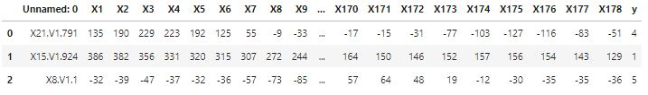
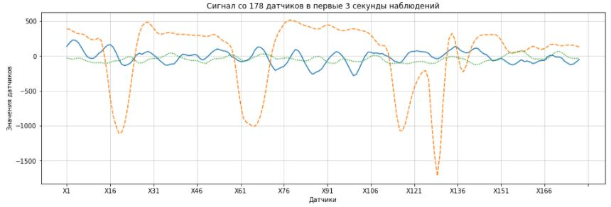
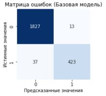
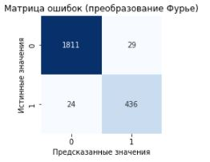
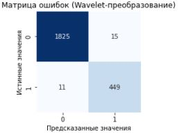
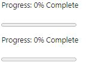
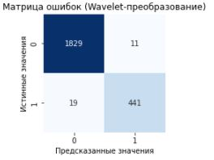

# Распознавание приступа эпилепсии по данным электроэнцефалограммы
Приступы эпилепсии характеризуются аномальной активностью мозга, которые можно попытаться распознать при помощи ЭЭГ. Необходимо построить модель прогнозирования приступов эпилепсии по данным активности мозга. Исходные данные с обнаружением эпилептических припадков на https://archive.ics.uci.edu/ml/datasets/Epileptic+Seizure+Recognition

## Подключение библиотек
```python
# Импорт основных библиотек
import numpy as np
import pandas as pd

# Импорт библиотек машинного обучения
from sklearn.model_selection import train_test_split
from sklearn.pipeline import Pipeline
from sklearn.preprocessing import StandardScaler
from sklearn.metrics import roc_auc_score, confusion_matrix
from sklearn.naive_bayes import GaussianNB
from lightgbm import LGBMClassifier

# Импорт библиотеки научных расчетов
from scipy.fft import rfft, rfftfreq

# Импорт библиотеки обнаружения пиков в данных
from detecta import detect_peaks

# Импорт библиотеки Wavelet-преобразования
from pywt import wavedec

# Импорт библиотеки извлечения признаков из временных рядов
import tsfel

# Импорт библиотек построения диаграмм и графиков
from matplotlib.ticker import MultipleLocator
import matplotlib.pyplot as plt
import seaborn as sns

# Импорт библиотеки управления предупреждениями
import warnings

# Отключение предупреждающих сообщений
warnings.filterwarnings("ignore")

# Определение режима вывода диаграмм
%matplotlib inline

# Определение стиля отображения диаграмм
plt.rc('axes', grid=True)
plt.rc('grid', linewidth=0.5)
```

## Загрузка исходных данных
```python
epileptic_data = pd.read_csv('data.csv', low_memory=False)
epileptic_data.head(3)
```


## Разведочный анализ
```python
# Вывод информации о структуре исходных данных
epileptic_data.info(show_counts=True, verbose=True)
```
```
<class 'pandas.core.frame.DataFrame'>
RangeIndex: 11500 entries, 0 to 11499
Data columns (total 180 columns):
 #    Column      Non-Null Count  Dtype 
---   ------      --------------  ----- 
 0    Unnamed: 0  11500 non-null  object
 1    X1          11500 non-null  int64 
 2    X2          11500 non-null  int64 
 3    X3          11500 non-null  int64 
 4    X4          11500 non-null  int64 
 5    X5          11500 non-null  int64 
 6    X6          11500 non-null  int64 
 7    X7          11500 non-null  int64 
 8    X8          11500 non-null  int64 
 9    X9          11500 non-null  int64 
 10   X10         11500 non-null  int64 
 11   X11         11500 non-null  int64 
 12   X12         11500 non-null  int64 
 13   X13         11500 non-null  int64 
 14   X14         11500 non-null  int64 
 15   X15         11500 non-null  int64 
 16   X16         11500 non-null  int64 
 17   X17         11500 non-null  int64 
 18   X18         11500 non-null  int64 
 19   X19         11500 non-null  int64 
 20   X20         11500 non-null  int64 
 21   X21         11500 non-null  int64 
 22   X22         11500 non-null  int64 
 23   X23         11500 non-null  int64 
 24   X24         11500 non-null  int64 
 25   X25         11500 non-null  int64 
 26   X26         11500 non-null  int64 
 27   X27         11500 non-null  int64 
 28   X28         11500 non-null  int64 
 29   X29         11500 non-null  int64 
 30   X30         11500 non-null  int64 
 31   X31         11500 non-null  int64 
 32   X32         11500 non-null  int64 
 33   X33         11500 non-null  int64 
 34   X34         11500 non-null  int64 
 35   X35         11500 non-null  int64 
 36   X36         11500 non-null  int64 
 37   X37         11500 non-null  int64 
 38   X38         11500 non-null  int64 
 39   X39         11500 non-null  int64 
 40   X40         11500 non-null  int64 
 41   X41         11500 non-null  int64 
 42   X42         11500 non-null  int64 
 43   X43         11500 non-null  int64 
 44   X44         11500 non-null  int64 
 45   X45         11500 non-null  int64 
 46   X46         11500 non-null  int64 
 47   X47         11500 non-null  int64 
 48   X48         11500 non-null  int64 
 49   X49         11500 non-null  int64 
 50   X50         11500 non-null  int64 
 51   X51         11500 non-null  int64 
 52   X52         11500 non-null  int64 
 53   X53         11500 non-null  int64 
 54   X54         11500 non-null  int64 
 55   X55         11500 non-null  int64 
 56   X56         11500 non-null  int64 
 57   X57         11500 non-null  int64 
 58   X58         11500 non-null  int64 
 59   X59         11500 non-null  int64 
 60   X60         11500 non-null  int64 
 61   X61         11500 non-null  int64 
 62   X62         11500 non-null  int64 
 63   X63         11500 non-null  int64 
 64   X64         11500 non-null  int64 
 65   X65         11500 non-null  int64 
 66   X66         11500 non-null  int64 
 67   X67         11500 non-null  int64 
 68   X68         11500 non-null  int64 
 69   X69         11500 non-null  int64 
 70   X70         11500 non-null  int64 
 71   X71         11500 non-null  int64 
 72   X72         11500 non-null  int64 
 73   X73         11500 non-null  int64 
 74   X74         11500 non-null  int64 
 75   X75         11500 non-null  int64 
 76   X76         11500 non-null  int64 
 77   X77         11500 non-null  int64 
 78   X78         11500 non-null  int64 
 79   X79         11500 non-null  int64 
 80   X80         11500 non-null  int64 
 81   X81         11500 non-null  int64 
 82   X82         11500 non-null  int64 
 83   X83         11500 non-null  int64 
 84   X84         11500 non-null  int64 
 85   X85         11500 non-null  int64 
 86   X86         11500 non-null  int64 
 87   X87         11500 non-null  int64 
 88   X88         11500 non-null  int64 
 89   X89         11500 non-null  int64 
 90   X90         11500 non-null  int64 
 91   X91         11500 non-null  int64 
 92   X92         11500 non-null  int64 
 93   X93         11500 non-null  int64 
 94   X94         11500 non-null  int64 
 95   X95         11500 non-null  int64 
 96   X96         11500 non-null  int64 
 97   X97         11500 non-null  int64 
 98   X98         11500 non-null  int64 
 99   X99         11500 non-null  int64 
 100  X100        11500 non-null  int64 
 101  X101        11500 non-null  int64 
 102  X102        11500 non-null  int64 
 103  X103        11500 non-null  int64 
 104  X104        11500 non-null  int64 
 105  X105        11500 non-null  int64 
 106  X106        11500 non-null  int64 
 107  X107        11500 non-null  int64 
 108  X108        11500 non-null  int64 
 109  X109        11500 non-null  int64 
 110  X110        11500 non-null  int64 
 111  X111        11500 non-null  int64 
 112  X112        11500 non-null  int64 
 113  X113        11500 non-null  int64 
 114  X114        11500 non-null  int64 
 115  X115        11500 non-null  int64 
 116  X116        11500 non-null  int64 
 117  X117        11500 non-null  int64 
 118  X118        11500 non-null  int64 
 119  X119        11500 non-null  int64 
 120  X120        11500 non-null  int64 
 121  X121        11500 non-null  int64 
 122  X122        11500 non-null  int64 
 123  X123        11500 non-null  int64 
 124  X124        11500 non-null  int64 
 125  X125        11500 non-null  int64 
 126  X126        11500 non-null  int64 
 127  X127        11500 non-null  int64 
 128  X128        11500 non-null  int64 
 129  X129        11500 non-null  int64 
 130  X130        11500 non-null  int64 
 131  X131        11500 non-null  int64 
 132  X132        11500 non-null  int64 
 133  X133        11500 non-null  int64 
 134  X134        11500 non-null  int64 
 135  X135        11500 non-null  int64 
 136  X136        11500 non-null  int64 
 137  X137        11500 non-null  int64 
 138  X138        11500 non-null  int64 
 139  X139        11500 non-null  int64 
 140  X140        11500 non-null  int64 
 141  X141        11500 non-null  int64 
 142  X142        11500 non-null  int64 
 143  X143        11500 non-null  int64 
 144  X144        11500 non-null  int64 
 145  X145        11500 non-null  int64 
 146  X146        11500 non-null  int64 
 147  X147        11500 non-null  int64 
 148  X148        11500 non-null  int64 
 149  X149        11500 non-null  int64 
 150  X150        11500 non-null  int64 
 151  X151        11500 non-null  int64 
 152  X152        11500 non-null  int64 
 153  X153        11500 non-null  int64 
 154  X154        11500 non-null  int64 
 155  X155        11500 non-null  int64 
 156  X156        11500 non-null  int64 
 157  X157        11500 non-null  int64 
 158  X158        11500 non-null  int64 
 159  X159        11500 non-null  int64 
 160  X160        11500 non-null  int64 
 161  X161        11500 non-null  int64 
 162  X162        11500 non-null  int64 
 163  X163        11500 non-null  int64 
 164  X164        11500 non-null  int64 
 165  X165        11500 non-null  int64 
 166  X166        11500 non-null  int64 
 167  X167        11500 non-null  int64 
 168  X168        11500 non-null  int64 
 169  X169        11500 non-null  int64 
 170  X170        11500 non-null  int64 
 171  X171        11500 non-null  int64 
 172  X172        11500 non-null  int64 
 173  X173        11500 non-null  int64 
 174  X174        11500 non-null  int64 
 175  X175        11500 non-null  int64 
 176  X176        11500 non-null  int64 
 177  X177        11500 non-null  int64 
 178  X178        11500 non-null  int64 
 179  y           11500 non-null  int64 
dtypes: int64(179), object(1)
memory usage: 15.8+ MB
```

```python
# Преобразование целевого признака в бинарный признак
epileptic_data['y'] = np.where(epileptic_data['y'] > 1, 0, 1)
```

```python
# Вывод данных со 178 датчиков в первые секунды наблюдений
fig = plt.figure(figsize=(16,5))

sns.lineplot(data=epileptic_data.iloc[0:3, 1:-1].T, legend=False)

# Скрытие большого числа меток оси абсцисс
plt.gca().axes.xaxis.set_major_locator(MultipleLocator(base=15))

# Оформление диаграммы
plt.title('Сигнал со 178 датчиков в первые 3 секунды наблюдений')
plt.ylabel('Значения датчиков')
plt.xlabel('Датчики')

# Вывод диаграммы
plt.show()
```


## Предобработка данных
```python
# Разбиение данных на тренировочную и тестовую выборки
X_train, X_test, Y_train, Y_test = train_test_split(
    epileptic_data.iloc[:, 1:-1].values, epileptic_data.iloc[:, -1], 
    train_size=0.8, stratify=epileptic_data.iloc[:, -1], random_state=42)
```
## Построение модели
### Базовая модель
```python
# Построение модели классификации
model_pipeline = Pipeline([
    ('scaler', StandardScaler()),
    ('classifier', LGBMClassifier())
])

Y_pred = model_pipeline.fit(X_train, Y_train).predict(X_test)

# Вывод оценки качества модели
print('ROC-AUC: {:0.2f}'.format(roc_auc_score(Y_test, Y_pred)))
```
```
ROC-AUC: 0.96
```

```python
# Вывод матрицы ошибок классифицированных данных
plt.figure(figsize=(3,3))

ax = sns.heatmap(confusion_matrix(Y_test, Y_pred), annot=True, fmt='d', cbar=False, cmap='Blues')
ax.set_title('Матрица ошибок (Базовая модель)')
ax.set_xlabel('Предсказанные значения')
ax.set_ylabel('Истинные значения')

plt.show()
```


### Модель на основе преобразования Фурье 
```python
# Количество значимых пиков (признаков)
PEAKS_COUNT = 10

# Функция извлечения признаков из сигнала с помощью преобразования Фурье
def features_fft(data: np.array):
    features = []
    for i in range(data.shape[0]):
        # Разложение сигнала на спектр частот и амплитуд
        y_values = np.abs(rfft(data[i])) * (2 / len(data[i]))
        x_values = rfftfreq(len(data[i]))
        # Определение пиков в спектре частот (амплитуд)
        idx_peaks = detect_peaks(y_values)
        # Построение вектора частот и амплитуд нужной длины (координаты пиков)
        if len(idx_peaks) >= PEAKS_COUNT:
            x_peaks = x_values[idx_peaks][:PEAKS_COUNT]
            y_peaks = y_values[idx_peaks][:PEAKS_COUNT]
        else:
            x_peaks = np.append(x_values[idx_peaks], [0]*(PEAKS_COUNT - len(idx_peaks)))
            y_peaks = np.append(y_values[idx_peaks], [0]*(PEAKS_COUNT - len(idx_peaks)))
        # Формирование матрицы извлеченных признаков
        features.append((x_peaks + y_peaks).tolist())
    
    return np.array(features)
```

```python
# Извлечение из сигнала новых признаков с помощью преобразования Фурье
X_train_fft, X_test_fft = features_fft(X_train), features_fft(X_test)

# Прогнозирование приступов эпилепсии
Y_pred = model_pipeline.fit(X_train_fft, Y_train).predict(X_test_fft)

# Вывод оценки качества модели
print('ROC-AUC: {:0.2f}'.format(roc_auc_score(Y_test, Y_pred)))
```

```
ROC-AUC: 0.97
```

```python
# Вывод матрицы ошибок классифицированных данных
plt.figure(figsize=(3,3))

ax = sns.heatmap(confusion_matrix(Y_test, Y_pred), annot=True, fmt='d', cbar=False, cmap='Blues')
ax.set_title('Матрица ошибок (преобразование Фурье)')
ax.set_xlabel('Предсказанные значения')
ax.set_ylabel('Истинные значения')

plt.show()
```


### Модель на основе Wavelet трансформации
```python
# Функция извлечения признаков из сигнала с помощью Wavelet-преобразования
def features_wavelet(data: np.array, wavelet_name = 'db5'):
    features = []
    for i in range(data.shape[0]):
        # Получение из исходного сигнала коэффициентов аппроксимации и детализации
        list_coeffs = wavedec(data[i], wavelet_name)
        # Расчет основных статистических данных для коэффициентов
        statistic_features = []
        for coeffs in list_coeffs:
            statistic_features.extend([
                np.nanpercentile(coeffs, 5),
                np.nanpercentile(coeffs, 95),
                np.nanmean(coeffs),
                np.nanvar(coeffs),
                np.nanmean(np.sqrt(coeffs**2))
            ])
        # Формирование матрицы извлеченных признаков
        features.append(statistic_features)
        
    return np.array(features)
```

```python
# Извлечение из сигнала новых признаков с помощью Wavelet-преобразования
X_train_wt, X_test_wt = features_wavelet(X_train), features_wavelet(X_test)

# Прогнозирование приступов эпилепсии
Y_pred = model_pipeline.fit(X_train_wt, Y_train).predict(X_test_wt)

# Вывод оценки качества модели
print('ROC-AUC: {:0.2f}'.format(roc_auc_score(Y_test, Y_pred)))
```
```
ROC-AUC: 0.98
```

```python
# Вывод матрицы ошибок классифицированных данных
plt.figure(figsize=(3,3))

ax = sns.heatmap(confusion_matrix(Y_test, Y_pred), annot=True, fmt='d', cbar=False, cmap='Blues')
ax.set_title('Матрица ошибок (Wavelet-преобразование)')
ax.set_xlabel('Предсказанные значения')
ax.set_ylabel('Истинные значения')

plt.show()
```


### Модель на основе признаков TsFel
```python
# Извлечение новых признаков из временного ряда (исходного сигнала)
cfg_file = tsfel.get_features_by_domain('temporal')
X_train_tsfel = tsfel.time_series_features_extractor(cfg_file, X_train, verbose=0)
X_test_tsfel = tsfel.time_series_features_extractor(cfg_file, X_test, verbose=0)
```


```python
# Прогнозирование приступов эпилепсии
Y_pred = model_pipeline.fit(X_train_tsfel, Y_train).predict(X_test_tsfel)

# Вывод оценки качества модели
print('ROC-AUC: {:0.2f}'.format(roc_auc_score(Y_test, Y_pred)))
```

```
ROC-AUC: 0.98
```

```python
# Вывод матрицы ошибок классифицированных данных
plt.figure(figsize=(3,3))

ax = sns.heatmap(confusion_matrix(Y_test, Y_pred), annot=True, fmt='d', cbar=False, cmap='Blues')
ax.set_title('Матрица ошибок (Wavelet-преобразование)')
ax.set_xlabel('Предсказанные значения')
ax.set_ylabel('Истинные значения')

plt.show()
```


## Выводы
Модель классификации построенная на признаках извлеченных из нестационарного сигнала с помощью преобразование Фурье показывает хорошие результаты. Но Wavelet-преобразование, учитывающее не только область частот и амплитуд, но и область времени дает лучше результат классификации для сигнала с динамическим спектром частот. Библиотека TsFel также показывает хороший результат, но и является самым ресурсоемким способом извлечения признаков.
